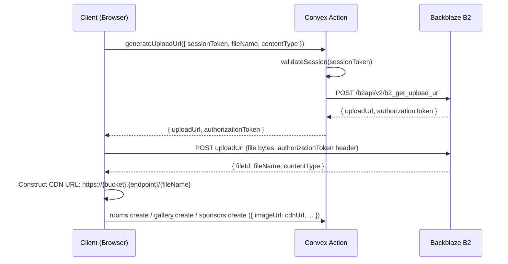

# Design Document: Convex Admin Panel

## Overview

This design covers the integration of Convex as the backend database for the Kai Hotel Bar website and the transformation of the existing static admin page into a fully functional, authenticated admin panel. The system provides hotel staff with real-time content management for rooms, gallery images, sponsors, and site settings, with all image assets stored in Backblaze B2.

The existing `src/routes/admin.tsx` is a static prototype with hardcoded data. This feature replaces it with a live, Convex-backed implementation while preserving the existing visual design language (EB Garamond + Hanken Grotesk, the botanical color palette, and the sidebar layout shown in `Example_design_screen/adminHome.html`).

### Key Design Decisions

- **Custom session-based auth over Convex Auth**: Convex Auth (the official package) adds complexity and is designed for end-user auth. Since this is a single-admin system with predetermined credentials, a custom session token approach using Convex mutations is simpler, more auditable, and avoids external OAuth dependencies.
- **B2 pre-signed URLs over Convex file storage**: Convex file storage has size limits and costs. B2 is already chosen by the requirements; pre-signed URLs keep binary data out of Convex entirely.
- **TanStack Router nested routes for admin**: The admin panel uses a layout route (`/admin`) with child routes (`/admin/login`, `/admin/dashboard`) so the sidebar and auth guard are shared across all admin views.
- **Tab state via URL search params**: Active tab is stored in the URL (`/admin?tab=rooms`) so deep-linking and browser back/forward work correctly.

---

## Architecture

```mermaid
graph TB
    subgraph Browser
        A[React App - TanStack Router]
        B[Auth Guard Component]
        C[Admin Layout]
        D[Tab Components]
        E[B2 Direct Upload]
    end

    subgraph Convex Backend
        F[Convex Queries - Real-time]
        G[Convex Mutations - Write]
        H[Convex Actions - Side Effects]
        I[Convex DB]
    end

    subgraph Backblaze B2
        J[B2 Bucket - Image Storage]
    end

    A --> B
    B -->|authenticated| C
    B -->|unauthenticated| K[/admin/login]
    C --> D
    D --> F
    D --> G
    H --> J
    D -->|1. request pre-signed URL| H
    H -->|2. return B2_Upload_URL| D
    D -->|3. upload directly| E
    E --> J
    D -->|4. store B2 URL| G
    F --> I
    G --> I
```

### Data Flow Summary

1. **Authentication**: Client calls `auth:login` mutation → Convex validates hashed password → returns session token → stored in `localStorage` → sent as argument to all protected mutations/actions.
2. **Real-time reads**: Components use `useQuery(api.rooms.list)` — Convex pushes updates automatically when data changes.
3. **Writes**: Components call `useMutation(api.rooms.create)` with session token in args — Convex validates session before writing.
4. **Image uploads**: Component calls `actions:generateB2UploadUrl` → receives pre-signed URL → uploads file directly from browser to B2 → stores returned CDN URL in Convex document.

---

## Components and Interfaces

### Route Structure

TanStack Router file-based routes:

```
src/routes/
  admin/
    _layout.tsx          # Admin layout route (sidebar, auth guard)
    _layout.index.tsx    # Redirects to ?tab=analytics
    login.tsx            # /admin/login - unauthenticated login page
  admin.tsx              # Existing file - replaced by layout route
```

> **Note**: TanStack Router uses `_layout` prefix for pathless layout routes. The existing `admin.tsx` becomes `admin/_layout.tsx`. The login page lives at `admin/login.tsx` (path: `/admin/login`).

### Component Hierarchy

```
AdminLayout (_layout.tsx)
├── AuthGuard              # Checks session, redirects to /admin/login if absent
├── AdminSidebar           # Fixed left sidebar with nav items
│   ├── NavItem (×6)       # Analytics, Rooms, Gallery, Sponsors, Messages, Settings
│   ├── LanguageToggle     # ka/en switcher using existing useI18n()
│   └── LogoutButton       # Calls auth:logout mutation
└── AdminMain              # Main content area
    ├── AdminHeader        # Welcome text, live clock, action buttons
    └── <ActiveTab>        # Rendered based on ?tab= search param
        ├── AnalyticsTab
        ├── RoomsTab
        │   ├── RoomList
        │   ├── RoomCard (×n)
        │   └── RoomFormDialog
        ├── GalleryTab
        │   ├── GalleryGrid
        │   ├── GalleryImageCard (×n)
        │   └── ImageUploadDialog
        ├── SponsorsTab
        │   ├── SponsorList
        │   ├── SponsorRow (×n)
        │   └── SponsorFormDialog
        ├── MessagesTab
        │   ├── MessageList
        │   └── MessageDetailPanel
        └── SettingsTab
            └── SiteSettingsForm

LoginPage (login.tsx)
└── LoginForm              # Username + password, submit triggers auth:login
```

### Key Component Interfaces

```typescript
// Auth context — stored in React context, populated from localStorage
interface AdminAuthContext {
  sessionToken: string | null;
  login: (token: string) => void;
  logout: () => void;
}

// Tab navigation — driven by URL search param
type AdminTab = 'analytics' | 'rooms' | 'gallery' | 'sponsors' | 'messages' | 'settings';

// Image upload hook — shared across Rooms, Gallery, Sponsors
interface UseB2Upload {
  upload: (file: File) => Promise<string>; // returns B2 CDN URL
  isUploading: boolean;
  error: string | null;
}
```

---

## Data Models

### Convex Schema (`convex/schema.ts`)

```typescript
import { defineSchema, defineTable } from "convex/server";
import { v } from "convex/values";

export default defineSchema({
  // Admin authentication
  adminUsers: defineTable({
    username: v.string(),
    passwordHash: v.string(),   // bcrypt hash, never plaintext
    createdAt: v.number(),
  }).index("by_username", ["username"]),

  adminSessions: defineTable({
    adminUserId: v.id("adminUsers"),
    token: v.string(),          // crypto.randomUUID() — 128-bit random
    expiresAt: v.number(),      // Unix ms timestamp
    createdAt: v.number(),
  }).index("by_token", ["token"]),

  // Content tables
  rooms: defineTable({
    nameKa: v.string(),
    nameEn: v.string(),
    descriptionKa: v.string(),
    descriptionEn: v.string(),
    pricePerNight: v.number(),
    capacity: v.number(),
    amenities: v.array(v.string()),
    imageUrl: v.string(),       // B2 CDN URL
    createdAt: v.number(),
    updatedAt: v.number(),
  }),

  galleryImages: defineTable({
    imageUrl: v.string(),       // B2 CDN URL
    altText: v.string(),
    displayOrder: v.number(),
    createdAt: v.number(),
  }).index("by_display_order", ["displayOrder"]),

  sponsors: defineTable({
    name: v.string(),
    websiteUrl: v.string(),
    logoUrl: v.string(),        // B2 CDN URL
    displayOrder: v.number(),
    createdAt: v.number(),
    updatedAt: v.number(),
  }).index("by_display_order", ["displayOrder"]),

  messages: defineTable({
    senderName: v.string(),
    email: v.string(),
    inquiryType: v.string(),
    body: v.string(),
    isRead: v.boolean(),
    submittedAt: v.number(),    // Unix ms timestamp
  }).index("by_submitted_at", ["submittedAt"]),

  siteSettings: defineTable({
    // Singleton — only one record; upserted by settings mutation
    phone: v.string(),
    email: v.string(),
    addressKa: v.string(),
    addressEn: v.string(),
    instagramUrl: v.string(),
    facebookUrl: v.string(),
    aboutKa: v.string(),
    aboutEn: v.string(),
    updatedAt: v.number(),
  }),
});
```

### Session Token Lifecycle

- Generated: `crypto.randomUUID()` in the `auth:login` mutation (Node.js runtime)
- Stored: `adminSessions` table with `expiresAt = Date.now() + 24 * 60 * 60 * 1000` (24h)
- Transmitted: Passed as a plain argument `{ sessionToken: string }` to every protected mutation/action
- Validated: Each protected function calls an internal `validateSession(ctx, sessionToken)` helper that queries `adminSessions` by token and checks `expiresAt > Date.now()`
- Invalidated: `auth:logout` mutation sets `expiresAt = 0` on the session record
- Client storage: `localStorage.setItem("adminSessionToken", token)` — cleared on logout

---

## Convex Function Definitions

### Auth Functions (`convex/auth.ts`)

```typescript
// Mutation: login
// Args: { username: string, password: string }
// Returns: { token: string } | throws ConvexError("Invalid credentials")
export const login = mutation({ ... });

// Mutation: logout
// Args: { sessionToken: string }
// Returns: null
export const logout = mutation({ ... });

// Mutation: seedAdmin (callable from Convex dashboard/CLI only)
// Args: { username: string, password: string }
// Returns: null
// Note: Uses bcrypt to hash password before storing
export const seedAdmin = mutation({ ... });

// Internal helper (not exported as API)
// Returns adminUserId if valid, throws ConvexError("Unauthorized") if not
export const validateSession = internalMutation({ ... });
```

### Content Functions

```typescript
// convex/rooms.ts
export const list = query();                    // Returns all rooms
export const create = mutation();               // Requires sessionToken
export const update = mutation();               // Requires sessionToken
export const remove = mutation();               // Requires sessionToken

// convex/gallery.ts
export const list = query();                    // Returns images sorted by displayOrder ASC
export const create = mutation();               // Requires sessionToken
export const remove = mutation();               // Requires sessionToken

// convex/sponsors.ts
export const list = query();                    // Returns sponsors sorted by displayOrder ASC
export const create = mutation();               // Requires sessionToken
export const update = mutation();               // Requires sessionToken
export const remove = mutation();               // Requires sessionToken

// convex/messages.ts
export const list = query();                    // Returns messages sorted by submittedAt DESC
export const submit = mutation();               // Public — called from contact form
export const markRead = mutation();             // Requires sessionToken
export const unreadCount = query();             // Returns count of isRead=false records

// convex/siteSettings.ts
export const get = query();                     // Returns singleton or null
export const upsert = mutation();               // Requires sessionToken

// convex/b2.ts
export const generateUploadUrl = action();      // Requires sessionToken; calls B2 API
```

---

## B2 Upload Flow



### B2 Environment Variables (Convex environment)

```
B2_APPLICATION_KEY_ID=<key-id>
B2_APPLICATION_KEY=<application-key>
B2_BUCKET_ID=<bucket-id>
B2_BUCKET_NAME=<bucket-name>
B2_ENDPOINT=<s3-compatible-endpoint>
```

These are set via `npx convex env set` and are never committed to source code.

---

## Route Structure (TanStack Router)

### File Layout

```
src/routes/
  admin/
    _layout.tsx          # Layout route — renders AuthGuard + AdminSidebar + <Outlet />
    _layout.index.tsx    # Index: redirects to /admin?tab=analytics
    login.tsx            # /admin/login — public login page
```

### Search Params Schema

```typescript
// In _layout.tsx
const adminSearchSchema = z.object({
  tab: z.enum(['analytics', 'rooms', 'gallery', 'sponsors', 'messages', 'settings'])
        .default('analytics'),
});
```

### Auth Guard Logic

```typescript
// In _layout.tsx beforeLoad
beforeLoad: ({ context, location }) => {
  const token = localStorage.getItem('adminSessionToken');
  if (!token) {
    throw redirect({ to: '/admin/login', search: { redirect: location.href } });
  }
}
```

The login page reads the `redirect` search param and navigates there after successful login.

---

## Data Flow Per Tab

### Analytics Tab

- **Query**: `useQuery(api.rooms.list)`, `useQuery(api.gallery.list)`, `useQuery(api.sponsors.list)`, `useQuery(api.messages.unreadCount)`
- **Display**: Count of each collection + unread message count in stat cards
- **Real-time**: All `useQuery` hooks auto-update when Convex data changes

### Rooms Tab

- **List query**: `useQuery(api.rooms.list)`
- **Create**: `useMutation(api.rooms.create)` — preceded by B2 upload via `generateUploadUrl` action
- **Update**: `useMutation(api.rooms.update)`
- **Delete**: `useMutation(api.rooms.remove)` — after confirmation dialog
- **Form state**: Managed with `useState` in `RoomFormDialog`; validation runs on submit

### Gallery Tab

- **List query**: `useQuery(api.gallery.list)` — returns records sorted by `displayOrder` ASC
- **Upload**: B2 upload → `useMutation(api.gallery.create)`
- **Delete**: `useMutation(api.gallery.remove)` — after confirmation dialog
- **File validation**: Client-side check before calling `generateUploadUrl` (type + size)

### Sponsors Tab

- **List query**: `useQuery(api.sponsors.list)` — sorted by `displayOrder` ASC
- **Create/Update/Delete**: Same pattern as Rooms

### Messages Tab

- **List query**: `useQuery(api.messages.list)` — sorted by `submittedAt` DESC
- **Mark read**: `useMutation(api.messages.markRead)` — called on message click
- **Unread badge**: `useQuery(api.messages.unreadCount)` — displayed on sidebar nav item
- **Real-time**: New messages appear automatically via Convex subscription

### Settings Tab

- **Get query**: `useQuery(api.siteSettings.get)`
- **Upsert**: `useMutation(api.siteSettings.upsert)`
- **Form**: Pre-populated from query result; bilingual fields shown side-by-side

---

## UI Component Breakdown

### AdminSidebar

Matches the existing design in `admin.tsx` and `adminHome.html`. Key behaviors:
- Active item: `bg-primary-container text-on-primary-container rounded-full`
- Inactive item: `text-on-surface-variant hover:bg-surface-container-high rounded-full`
- Unread badge on Messages item: small `bg-error text-on-error` pill with count
- Language toggle: small button in header area, toggles `ka`/`en` via `useI18n()`
- Logout: calls `auth:logout` mutation, clears `localStorage`, navigates to `/admin/login`

### RoomFormDialog / SponsorFormDialog

Shared pattern:
- shadcn/ui `Dialog` component wrapping a form
- Bilingual text fields rendered as two adjacent inputs (Georgian | English)
- Image upload: file input → client validation → B2 upload → URL stored in form state
- Submit: validates required fields → calls create or update mutation
- Loading state: submit button disabled with spinner while mutation is in-flight

### ImageUploadDialog (Gallery)

- File picker with `accept="image/jpeg,image/png,image/webp"`
- Client-side validation: `file.size <= 10 * 1024 * 1024` and `file.type` check
- Progress indicator during B2 upload
- Alt text input field

### ConfirmationDialog

Reusable component used for all delete operations:
- shadcn/ui `AlertDialog`
- Props: `title`, `description`, `onConfirm`, `onCancel`
- Confirm button styled with `bg-error text-on-error`

### MessageDetailPanel

- Slide-in panel (or inline expansion) showing full message details
- Automatically calls `markRead` mutation when opened
- Read/unread indicator: filled vs. outlined `mail` Material Symbol icon

### LoginPage

- Centered card on `bg-surface-container-low` background
- Hotel name header in EB Garamond
- Username + password inputs with bottom-border style (matching existing form aesthetic)
- Submit button: `bg-primary text-on-primary` — disabled + spinner while loading
- Error message: `text-error` below the form, shown only on failed login

---

## Error Handling

| Scenario | Handling |
|---|---|
| Login with invalid credentials | Display "Invalid credentials" below form (no field-specific hint) |
| Protected mutation called without session | Convex throws `ConvexError("Unauthorized")` — client catches and redirects to `/admin/login` |
| Session expired mid-session | Next mutation call returns Unauthorized — `onError` handler in mutation clears localStorage and redirects |
| B2 upload failure | Display "Image upload failed. Please try again." — no Convex record created |
| File too large or wrong format | Client-side: display "File must be JPEG, PNG, or WebP and under 10 MB" before upload attempt |
| Required form field empty | Field-level validation error shown inline; form not submitted |
| Convex network error | React error boundary catches; display generic "Something went wrong" with retry option |
| B2 environment variables missing | Convex action throws; error surfaced to client as upload failure |

---

## Testing Strategy

### Unit Tests (Vitest)

Focus on pure logic that doesn't require Convex or B2:
- Form validation functions (required field checks, file type/size validation)
- Session token utilities (expiry check logic)
- URL construction for B2 CDN URLs
- i18n key resolution for admin-specific translation keys
- Date/time formatting for the admin header clock

### Property-Based Tests (fast-check)

See Correctness Properties section below. Each property test uses fast-check with a minimum of 100 iterations. Tests are tagged with:

```
// Feature: convex-admin-panel, Property N: <property text>
```

### Integration Tests (Convex test environment)

Using `convex-test` (the official Convex testing library):
- Auth flow: seed admin → login → verify session created → logout → verify session invalidated
- CRUD operations: create/read/update/delete for each content table
- Real-time subscription: verify query results update after mutations
- Session validation: verify protected mutations reject invalid/expired tokens
- Contact form submission: verify message record created with correct fields

### Smoke Tests

- Verify `seedAdmin` mutation exists and can be called
- Verify B2 environment variables are set in Convex deployment
- Verify admin route redirects unauthenticated users to login

---

## Correctness Properties

*A property is a characteristic or behavior that should hold true across all valid executions of a system — essentially, a formal statement about what the system should do. Properties serve as the bridge between human-readable specifications and machine-verifiable correctness guarantees.*

This feature involves business logic (validation, sorting, access control, real-time data consistency) that is well-suited to property-based testing. The property-based testing library is **fast-check** (TypeScript-native, widely used with Vitest).

### Property 1: Invalid credentials always produce the same error

*For any* username/password pair that does not match the seeded admin credentials, the `auth:login` mutation SHALL return an error with the message "Invalid credentials", never revealing which field is incorrect.

**Validates: Requirements 1.3**

---

### Property 2: Session invalidation is permanent

*For any* Admin_Session that has been invalidated via logout, any subsequent call to a protected Convex mutation using that session token SHALL be rejected with "Unauthorized".

**Validates: Requirements 1.5, 1.7**

---

### Property 3: Protected mutations reject unauthenticated requests

*For any* protected Convex mutation (rooms.create, rooms.update, rooms.remove, gallery.create, gallery.remove, sponsors.create, sponsors.update, sponsors.remove, messages.markRead, siteSettings.upsert, b2.generateUploadUrl), calling it with an absent, malformed, or expired session token SHALL always return an "Unauthorized" error.

**Validates: Requirements 1.7, 8.6**

---

### Property 4: Navigation tab switching displays correct content

*For any* sidebar navigation item in the set {Analytics, Rooms, Gallery, Sponsors, Messages, Settings}, clicking that item SHALL display the corresponding tab content and apply the active highlight style (`bg-primary-container text-on-primary-container`) to exactly that navigation item.

**Validates: Requirements 2.2, 2.3**

---

### Property 5: Language toggle is a round-trip

*For any* admin UI text element, toggling the language from `ka` to `en` and back to `ka` SHALL restore the original Georgian text, and toggling from `en` to `ka` and back to `en` SHALL restore the original English text.

**Validates: Requirements 2.5**

---

### Property 6: Room list displays all Convex records

*For any* collection of Room records stored in Convex, navigating to the Rooms tab SHALL display exactly that many room cards — no more, no fewer.

**Validates: Requirements 3.1**

---

### Property 7: Room card renders all required fields

*For any* Room record with valid data, the rendered room card SHALL contain the room name, price per night, capacity, a thumbnail image, and both Edit and Delete action buttons.

**Validates: Requirements 3.2**

---

### Property 8: Room form validation rejects incomplete submissions

*For any* room form submission where at least one required field (name, price per night, or capacity) is empty or invalid, the form SHALL display a field-level validation error and SHALL NOT call the Convex create or update mutation.

**Validates: Requirements 3.9**

---

### Property 9: Content mutations propagate to real-time subscribers

*For any* mutation that creates, updates, or deletes a Room, Gallery_Image, or Site_Settings record, all active `useQuery` subscribers to the corresponding Convex query SHALL receive the updated data within 2 seconds.

**Validates: Requirements 3.10, 4.9, 7.5, 9.3**

---

### Property 10: Gallery images sorted by display order

*For any* collection of Gallery_Image records with distinct `displayOrder` values, the `gallery.list` Convex query SHALL return them in ascending order of `displayOrder`.

**Validates: Requirements 4.8**

---

### Property 11: File validation rejects oversized or unsupported files

*For any* file where `file.size > 10 * 1024 * 1024` OR `file.type` is not in `{image/jpeg, image/png, image/webp}`, the upload validation SHALL display "File must be JPEG, PNG, or WebP and under 10 MB" and SHALL NOT call `generateUploadUrl`.

**Validates: Requirements 4.5**

---

### Property 12: Sponsors sorted by display order

*For any* collection of Sponsor records with distinct `displayOrder` values, the `sponsors.list` Convex query SHALL return them in ascending order of `displayOrder`.

**Validates: Requirements 5.1**

---

### Property 13: Messages sorted by submission date descending

*For any* collection of message records with distinct `submittedAt` timestamps, the `messages.list` Convex query SHALL return them in descending order of `submittedAt`.

**Validates: Requirements 6.1**

---

### Property 14: Unread badge count matches actual unread messages

*For any* collection of message records with varying `isRead` values, the unread badge count displayed on the Messages sidebar item SHALL equal the count of records where `isRead === false`.

**Validates: Requirements 6.6**

---

### Property 15: Clicking a message marks it as read

*For any* message record where `isRead === false`, clicking on that message in the Messages tab SHALL call `messages.markRead` and the record's `isRead` field SHALL become `true`.

**Validates: Requirements 6.3**

---

### Property 16: Contact form submission creates a matching message record

*For any* valid contact form submission with fields {senderName, email, inquiryType, body}, a corresponding message record SHALL be created in Convex with those exact field values and `isRead === false`.

**Validates: Requirements 6.4**

---

### Property 17: Settings form upsert round-trip

*For any* valid Site_Settings data submitted via the Settings form, the `siteSettings.get` query SHALL subsequently return a record containing all the submitted field values.

**Validates: Requirements 7.3**

---

### Property 18: Settings form validation rejects missing required fields

*For any* settings form submission where phone number or email address is empty, the form SHALL display a field-level validation error and SHALL NOT call the `siteSettings.upsert` mutation.

**Validates: Requirements 7.4**

---

### Property 19: B2 upload stores only URL in Convex

*For any* completed image upload, the corresponding Convex document (room, gallery image, or sponsor) SHALL contain only a string URL in its image field — never binary data or a base64-encoded string.

**Validates: Requirements 8.1, 8.4**

---

### Property 20: Failed B2 upload prevents Convex record creation

*For any* B2 upload that fails (network error, auth error, or server error), no corresponding Convex document SHALL be created or updated, and the error message "Image upload failed. Please try again." SHALL be displayed.

**Validates: Requirements 8.5**

---

### Property 21: Analytics counts match actual record counts

*For any* state of the Convex database, the counts displayed on the Analytics tab SHALL equal the actual number of Room records, Gallery_Image records, Sponsor records, and unread message records respectively.

**Validates: Requirements 9.1**
