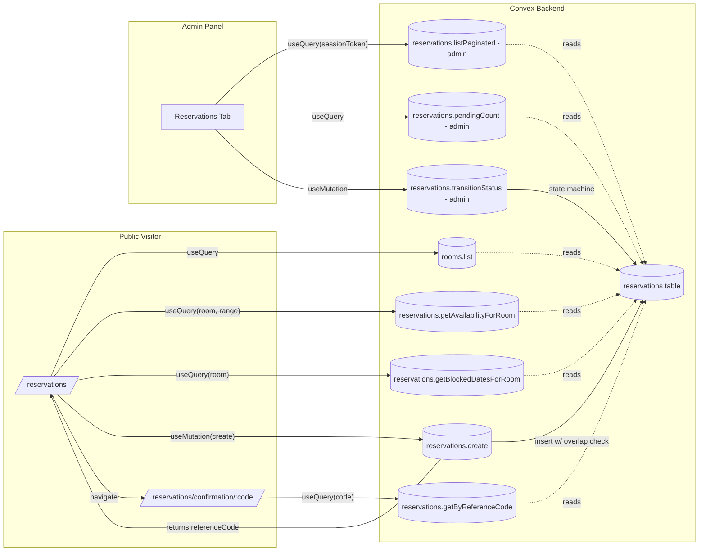
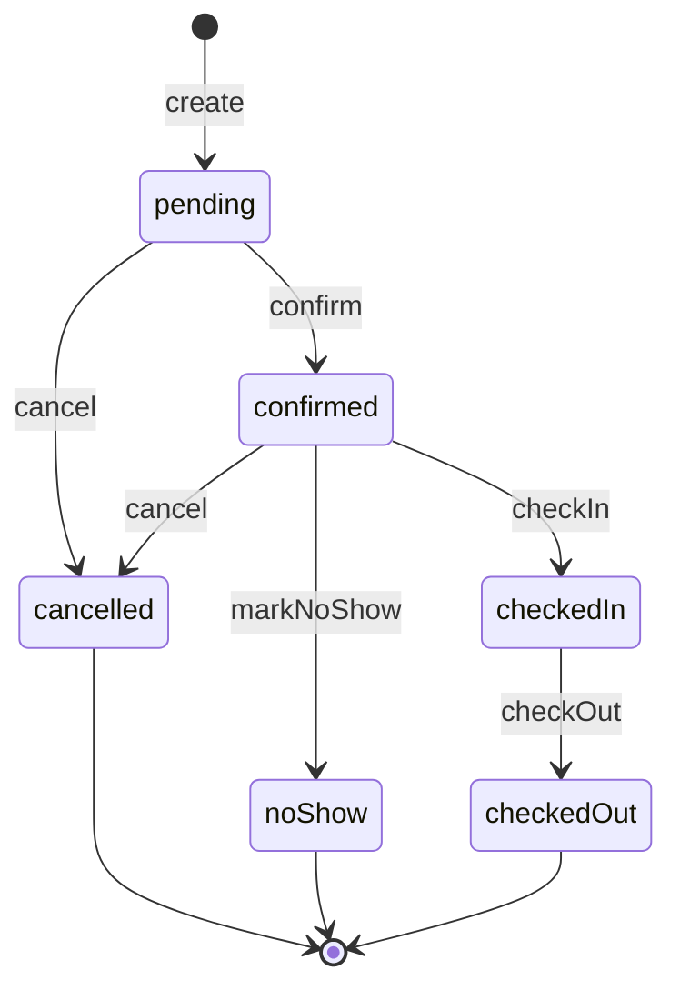

# Design Document

## Overview

The Reservation System is a full-stack replacement for the current static booking flow. It turns the public `/reservations` page into a live, three-step booking funnel backed by Convex, adds a guest-facing confirmation page, and adds a new admin tab that manages every reservation through an explicit lifecycle state machine. Every external `booking.com` redirect on the public site is removed so guests book exclusively through the in-site flow.

### Goals

- One Convex table (`reservations`) owns the full reservation record from creation through terminal status.
- Availability is computed on the server, inside the same mutation that inserts a reservation, so the no-double-booking invariant cannot be broken by a client race or a stale subscription.
- The public flow asks for just enough information to reach a guest on arrival (name, email, phone, guest count, room, dates, optional special requests).
- The admin panel exposes every reservation, filters it, and drives status changes through a finite set of allowed transitions.
- All booking.com outbound links disappear.

### Non-Goals (MVP)

- **No payment processing.** The hotel uses a "pay at hotel" model; the confirmation screen says so explicitly. No Stripe, no PayPal, no charges are captured. Total price is computed for display only.
- **No guest self-service cancellation.** Cancellation is admin-only for the MVP. A guest who needs to cancel contacts the hotel. The lookup-by-reference-code endpoint exists for a guest to view their reservation but does not expose a cancel action.
- **No email notifications.** We do not send confirmation emails in MVP. A stub `internal.reservations.notifyGuest` internal action is reserved as a future hook point; the create mutation can schedule it when we wire up a provider.
- **No guest account system.** Every reservation is created by an unauthenticated public visitor; we identify the record by `referenceCode` in public lookups.
- **Pricing rules are flat.** `totalPrice = room.pricePerNight × nights`. No seasonality, no taxes, no discounts in MVP.

### Timezone

All dates are stored as Unix millisecond timestamps normalized to `00:00:00 UTC` of the selected calendar date. The UI uses the visitor's local timezone date picker and, at submit time, converts the chosen local date into UTC midnight of that calendar date (i.e., we treat the picked date as a calendar label, not an instant). This matches Requirement 9.5 and keeps overlap math on plain integer-ms comparisons.

---

## Architecture

### High-Level Data Flow



### Runtime Model

Convex mutations are single-writer transactions. The `reservations.create` mutation:

1. Validates input (types, ranges, regex, capacity).
2. Normalizes `checkInDate` and `checkOutDate` to UTC midnight.
3. Reads all active reservations for the target `roomId` that could overlap using the `by_room_and_checkInDate` index.
4. Rejects if any active reservation overlaps `[checkInDate, checkOutDate)` per the glossary definition.
5. Generates a reference code and retries (bounded, up to 5 times) if the code already exists in the `by_reference_code` index.
6. Inserts the record with `status: "pending"` and returns `{ referenceCode }`.

Because step 3–6 run in one Convex transaction, no two conflicting creates can both succeed. If two mutations racing on the same room try to insert overlapping ranges, Convex's optimistic concurrency detection replays one of them, which will then see the other's row and reject in step 4.

### State Machine (Lifecycle)



Allowed transition table (the canonical list in code):

| From → To    | pending | confirmed | checkedIn | checkedOut | cancelled | noShow |
| ------------ | ------- | --------- | --------- | ---------- | --------- | ------ |
| pending      | —       | ✓         | —         | —          | ✓         | —      |
| confirmed    | —       | —         | ✓         | —          | ✓         | ✓      |
| checkedIn    | —       | —         | —         | ✓          | —         | —      |
| checkedOut   | —       | —         | —         | —          | —         | —      |
| cancelled    | —       | —         | —         | —          | —         | —      |
| noShow       | —       | —         | —         | —          | —         | —      |

Terminal statuses are `checkedOut`, `cancelled`, `noShow`. Active statuses (used by availability) are `pending`, `confirmed`, `checkedIn`.

Side effects of transitions:

- `→ checkedIn`: set `checkedInAt = now`.
- `→ checkedOut`: set `checkedOutAt = now`.
- `→ cancelled`: set `cancelledAt = now`.
- `→ confirmed`, `→ noShow`: no additional timestamp fields (status change is the record).

---

## Components and Interfaces

### Convex Functions — New File `convex/reservations.ts`

All public mutations/queries use the new-style `args` + `returns` validator contract. All indexed lookups use `withIndex`; no `.filter()` on the query chain.

```ts
// convex/reservations.ts
import { v, ConvexError } from "convex/values";
import { paginationOptsValidator } from "convex/server";
import { query, mutation } from "./_generated/server";
import { Doc, Id } from "./_generated/dataModel";
import { validateSession } from "./utils";
import {
  STATUS_VALIDATOR,
  ACTIVE_STATUSES,
  TRANSITION_VALIDATOR,
  applyTransition,
  normalizeToUtcMidnight,
  nightCount,
  overlaps,
  validateGuestInput,
  generateReferenceCode,
} from "./availability";

/** PUBLIC: Is a room available for the given half-open date range [ci, co)? */
export const getAvailabilityForRoom = query({
  args: {
    roomId: v.id("rooms"),
    checkInDate: v.number(),
    checkOutDate: v.number(),
  },
  returns: v.object({ available: v.boolean() }),
  handler: async (ctx, args) => { /* … */ },
});

/** PUBLIC: Dates (UTC-midnight ms) blocked by any active reservation for a room,
 *  bounded to a look-ahead window to keep the payload small.
 *  Used to drive the month-view calendar in Step 1 of the public flow. */
export const getBlockedDatesForRoom = query({
  args: {
    roomId: v.id("rooms"),
    fromDate: v.number(),    // UTC midnight
    throughDate: v.number(), // UTC midnight (exclusive)
  },
  returns: v.array(v.number()),
  handler: async (ctx, args) => { /* … */ },
});

/** PUBLIC: Create a reservation. Validates, enforces overlap check, and
 *  returns the reference code on success. */
export const create = mutation({
  args: {
    roomId: v.id("rooms"),
    guestFullName: v.string(),
    guestEmail: v.string(),
    guestPhone: v.string(),
    guestCount: v.number(),
    checkInDate: v.number(),
    checkOutDate: v.number(),
    specialRequests: v.optional(v.string()),
  },
  returns: v.object({ referenceCode: v.string() }),
  handler: async (ctx, args) => { /* … */ },
});

/** PUBLIC: Look up a reservation by reference code. Returns the record or null. */
export const getByReferenceCode = query({
  args: { referenceCode: v.string() },
  returns: v.union(
    v.null(),
    v.object({
      _id: v.id("reservations"),
      _creationTime: v.number(),
      roomId: v.id("rooms"),
      referenceCode: v.string(),
      guestFullName: v.string(),
      guestEmail: v.string(),
      guestPhone: v.string(),
      guestCount: v.number(),
      checkInDate: v.number(),
      checkOutDate: v.number(),
      status: STATUS_VALIDATOR,
      totalPrice: v.number(),
      createdAt: v.number(),
      checkedInAt: v.optional(v.number()),
      checkedOutAt: v.optional(v.number()),
      cancelledAt: v.optional(v.number()),
      specialRequests: v.optional(v.string()),
    }),
  ),
  handler: async (ctx, args) => { /* … */ },
});

/** ADMIN: Paginated list of all reservations, ordered by createdAt desc. */
export const listPaginated = query({
  args: {
    sessionToken: v.string(),
    paginationOpts: paginationOptsValidator,
  },
  returns: v.object({
    page: v.array(v.any()), // documented via Doc<"reservations">
    isDone: v.boolean(),
    continueCursor: v.union(v.string(), v.null()),
  }),
  handler: async (ctx, args) => { /* … */ },
});

/** ADMIN: Count of reservations in `pending` status (for sidebar badge). */
export const pendingCount = query({
  args: { sessionToken: v.string() },
  returns: v.number(),
  handler: async (ctx, args) => { /* … */ },
});

/** ADMIN: Transition one reservation to a new status. */
export const transitionStatus = mutation({
  args: {
    sessionToken: v.string(),
    id: v.id("reservations"),
    transition: TRANSITION_VALIDATOR, // "confirm" | "cancel" | "checkIn" | "checkOut" | "markNoShow"
  },
  returns: v.null(),
  handler: async (ctx, args) => { /* … */ },
});
```

**Handler sketch — availability query:**

```ts
export const getAvailabilityForRoom = query({
  args: { roomId: v.id("rooms"), checkInDate: v.number(), checkOutDate: v.number() },
  returns: v.object({ available: v.boolean() }),
  handler: async (ctx, args) => {
    const ci = normalizeToUtcMidnight(args.checkInDate);
    const co = normalizeToUtcMidnight(args.checkOutDate);
    if (ci >= co) return { available: false };

    // Any reservation that overlaps [ci, co) must have checkInDate < co.
    // Use the by_room_and_checkInDate index to bound the scan.
    const candidates = await ctx.db
      .query("reservations")
      .withIndex("by_room_and_checkInDate", (q) =>
        q.eq("roomId", args.roomId).lt("checkInDate", co),
      )
      .take(500);

    const conflict = candidates.some(
      (r) =>
        ACTIVE_STATUSES.has(r.status) &&
        overlaps(r.checkInDate, r.checkOutDate, ci, co),
    );
    return { available: !conflict };
  },
});
```

**Handler sketch — create mutation:**

```ts
export const create = mutation({
  args: { /* … as above … */ },
  returns: v.object({ referenceCode: v.string() }),
  handler: async (ctx, args) => {
    const room = await ctx.db.get(args.roomId);
    if (!room) throw new ConvexError("Room not found");

    const validated = validateGuestInput({
      ...args,
      roomCapacity: room.capacity,
      now: Date.now(),
    });
    // validated returns { checkInDate, checkOutDate, ... } all normalized, or throws ConvexError.

    // Overlap check — same transaction.
    const candidates = await ctx.db
      .query("reservations")
      .withIndex("by_room_and_checkInDate", (q) =>
        q.eq("roomId", args.roomId).lt("checkInDate", validated.checkOutDate),
      )
      .take(500);
    const conflict = candidates.find(
      (r) =>
        ACTIVE_STATUSES.has(r.status) &&
        overlaps(r.checkInDate, r.checkOutDate, validated.checkInDate, validated.checkOutDate),
    );
    if (conflict) throw new ConvexError("Room is not available for those dates");

    // Unique reference code — retry up to 5 times.
    let referenceCode = "";
    for (let attempt = 0; attempt < 5; attempt++) {
      const code = generateReferenceCode();
      const existing = await ctx.db
        .query("reservations")
        .withIndex("by_reference_code", (q) => q.eq("referenceCode", code))
        .unique();
      if (!existing) { referenceCode = code; break; }
    }
    if (!referenceCode) throw new ConvexError("Could not allocate reference code");

    const nights = nightCount(validated.checkInDate, validated.checkOutDate);
    const totalPrice = room.pricePerNight * nights;

    await ctx.db.insert("reservations", {
      roomId: args.roomId,
      referenceCode,
      guestFullName: validated.guestFullName,
      guestEmail: validated.guestEmail,
      guestPhone: validated.guestPhone,
      guestCount: validated.guestCount,
      checkInDate: validated.checkInDate,
      checkOutDate: validated.checkOutDate,
      status: "pending",
      totalPrice,
      createdAt: Date.now(),
      specialRequests: validated.specialRequests,
    });
    return { referenceCode };
  },
});
```

**Handler sketch — transitionStatus:**

```ts
export const transitionStatus = mutation({
  args: { sessionToken: v.string(), id: v.id("reservations"), transition: TRANSITION_VALIDATOR },
  returns: v.null(),
  handler: async (ctx, args) => {
    await validateSession(ctx, args.sessionToken);
    const reservation = await ctx.db.get(args.id);
    if (!reservation) throw new ConvexError("Reservation not found");

    const patch = applyTransition(reservation.status, args.transition, Date.now());
    // applyTransition throws ConvexError("Invalid status transition") if not allowed;
    // otherwise returns the partial patch to apply.
    await ctx.db.patch(args.id, patch);
    return null;
  },
});
```

### Pure Helpers — New File `convex/availability.ts`

This file is pure (no `ctx.db`) so both Convex functions and `convex-test`/`vitest` property-based tests can import it. It is **not** a `"use node"` file.

```ts
// convex/availability.ts
import { v, ConvexError } from "convex/values";

export type Status = "pending" | "confirmed" | "checkedIn" | "checkedOut" | "cancelled" | "noShow";
export type Transition = "confirm" | "cancel" | "checkIn" | "checkOut" | "markNoShow";

export const STATUS_VALIDATOR = v.union(
  v.literal("pending"), v.literal("confirmed"), v.literal("checkedIn"),
  v.literal("checkedOut"), v.literal("cancelled"), v.literal("noShow"),
);
export const TRANSITION_VALIDATOR = v.union(
  v.literal("confirm"), v.literal("cancel"), v.literal("checkIn"),
  v.literal("checkOut"), v.literal("markNoShow"),
);

export const ACTIVE_STATUSES: ReadonlySet<Status> = new Set(["pending", "confirmed", "checkedIn"]);
export const TERMINAL_STATUSES: ReadonlySet<Status> = new Set(["checkedOut", "cancelled", "noShow"]);

/** Half-open overlap: [a1, a2) overlaps [b1, b2)  iff  a1 < b2 && b1 < a2. */
export function overlaps(a1: number, a2: number, b1: number, b2: number): boolean {
  return a1 < b2 && b1 < a2;
}

/** One day = 86_400_000 ms. */
export const MS_PER_DAY = 86_400_000;

/** Normalize an epoch-ms timestamp to UTC midnight of that calendar date. */
export function normalizeToUtcMidnight(ts: number): number {
  const d = new Date(ts);
  return Date.UTC(d.getUTCFullYear(), d.getUTCMonth(), d.getUTCDate());
}

/** Integer whole days between two UTC-midnight timestamps. */
export function nightCount(ci: number, co: number): number {
  return Math.round((co - ci) / MS_PER_DAY);
}

/** Transition table, single source of truth for both server and UI. */
const TRANSITIONS: Record<Status, Partial<Record<Transition, Status>>> = {
  pending:    { confirm: "confirmed", cancel: "cancelled" },
  confirmed:  { checkIn: "checkedIn", cancel: "cancelled", markNoShow: "noShow" },
  checkedIn:  { checkOut: "checkedOut" },
  checkedOut: {},
  cancelled:  {},
  noShow:     {},
};

export function nextStatus(current: Status, t: Transition): Status | null {
  return TRANSITIONS[current][t] ?? null;
}

export function allowedTransitions(current: Status): Transition[] {
  return Object.keys(TRANSITIONS[current]) as Transition[];
}

/** Returns the Convex patch for a transition, or throws ConvexError on invalid. */
export function applyTransition(
  current: Status,
  t: Transition,
  now: number,
): { status: Status; checkedInAt?: number; checkedOutAt?: number; cancelledAt?: number } {
  const next = nextStatus(current, t);
  if (!next) throw new ConvexError("Invalid status transition");
  const patch: { status: Status; checkedInAt?: number; checkedOutAt?: number; cancelledAt?: number } = { status: next };
  if (next === "checkedIn") patch.checkedInAt = now;
  else if (next === "checkedOut") patch.checkedOutAt = now;
  else if (next === "cancelled") patch.cancelledAt = now;
  return patch;
}

// ─── Validation ─────────────────────────────────────────────────────────────
const EMAIL_RE = /^[^\s@]+@[^\s@]+\.[^\s@]{2,}$/;
const PHONE_RE = /^[0-9+\-\s()]+$/;

export type GuestInput = {
  guestFullName: string;
  guestEmail: string;
  guestPhone: string;
  guestCount: number;
  checkInDate: number;
  checkOutDate: number;
  specialRequests?: string;
  roomCapacity: number;
  now: number;
};

export function validateGuestInput(input: GuestInput) {
  const name = input.guestFullName.trim();
  const email = input.guestEmail.trim();
  const phone = input.guestPhone.trim();
  if (!name) throw new ConvexError("Full name is required");
  if (!email) throw new ConvexError("Email is required");
  if (!phone) throw new ConvexError("Phone is required");
  if (!EMAIL_RE.test(email)) throw new ConvexError("Invalid email address");
  const digitCount = (phone.match(/\d/g) ?? []).length;
  if (!PHONE_RE.test(phone) || digitCount < 7) throw new ConvexError("Invalid phone number");
  if (input.guestCount < 1) throw new ConvexError("At least one guest is required");
  if (input.guestCount > input.roomCapacity) throw new ConvexError("Guest count exceeds room capacity");
  const ci = normalizeToUtcMidnight(input.checkInDate);
  const co = normalizeToUtcMidnight(input.checkOutDate);
  if (ci >= co) throw new ConvexError("Check-out must be after check-in");
  if (ci < normalizeToUtcMidnight(input.now)) throw new ConvexError("Check-in cannot be in the past");
  return {
    guestFullName: name,
    guestEmail: email,
    guestPhone: phone,
    guestCount: input.guestCount,
    checkInDate: ci,
    checkOutDate: co,
    specialRequests: input.specialRequests?.trim() || undefined,
  };
}

// ─── Reference code generation ──────────────────────────────────────────────
// Unambiguous alphabet: no 0/O, no 1/I/L.
const ALPHABET = "ABCDEFGHJKMNPQRSTUVWXYZ23456789";
const CODE_LEN = 8;

export function generateReferenceCode(rand: () => number = Math.random): string {
  let out = "";
  for (let i = 0; i < CODE_LEN; i++) {
    out += ALPHABET[Math.floor(rand() * ALPHABET.length)];
  }
  return out;
}
```

### Frontend Components and Routes

**New route — `src/routes/reservations.tsx` (replaces the existing mock file):**
- Three-step stepper matches today's look (dates/room → guest info → review).
- Step 1 loads `api.rooms.list` and, when a date range is selected, runs `api.reservations.getAvailabilityForRoom` per room. Rooms where `available === false` render with an "Unavailable" overlay and cannot be selected.
- Each room card surfaces a month-view calendar that calls `api.reservations.getBlockedDatesForRoom` with a 90-day look-ahead; the returned UTC-midnight timestamps are converted to local `Date` objects and passed to the existing `DatePicker` `disabledDates` prop.
- Step 3 "Confirm" button calls `api.reservations.create` via `useMutation`. On success, the component navigates to `/reservations/confirmation/$referenceCode` using the returned code. On failure it surfaces the `ConvexError.data.message` in an inline error banner near the submit button.

**New route — `src/routes/reservations.confirmation.$referenceCode.tsx`:**
- TanStack file route with a typed dynamic segment.
- Calls `api.reservations.getByReferenceCode({ referenceCode })`. Displays the reference code, room name, check-in / check-out, night count, total price, status pill, and guest details. If the query returns `null`, shows a "Reservation not found" empty state with a link back to the home page.

**New components:**

| File | Purpose |
| ---- | ------- |
| `src/components/admin/tabs/ReservationsTab.tsx` | Top-level tab shell. Calls `api.reservations.listPaginated`, wires up filter state, and renders rows + detail panel. |
| `src/components/admin/ReservationRow.tsx` | Row component (mirrors `MessageRow`). Renders ref code, guest name, room name, date range, nights, total, status badge, and a contextual action button row. |
| `src/components/admin/ReservationDetailPanel.tsx` | Expands inline below the selected row (mirrors `MessageDetailPanel`). Shows every field plus timestamps and all valid transition actions for the current status. |
| `src/components/admin/ReservationFilters.tsx` | Filter bar: status select (`all` \| one of six statuses), room select, check-in date range, free-text search. Filters are client-side over the currently paginated set; the design note below explains why. |
| `src/components/admin/StatusBadge.tsx` | Small pill colored per status (neutral for pending, primary for confirmed/checkedIn, success for checkedOut, error for cancelled, warning for noShow). |

**Filtering note.** Because the admin list uses `paginationOptsValidator` and the expected reservation count per hotel is small (hundreds, not millions) in MVP, the filters operate on the currently loaded pages. If we later need server-side filtering we add an `api.reservations.listFiltered` query using the `by_status` index plus additional indexes as needed; the Correctness Property 10 (filter subset) holds regardless of where the filter runs.

### Router Changes

- Register the new confirmation route file in `src/routeTree.gen.ts` (regenerated by the router on next `vite dev`).
- Update `src/routes/admin/_layout.tsx`:
  - Add `reservations` to the `adminSearchSchema` zod enum.
  - Import `ReservationsTab` and add it to `TAB_COMPONENTS`.

### AdminSidebar Changes

In `src/components/admin/AdminSidebar.tsx`:
- Add `{ icon: "event_available", tab: "reservations", labelKey: "admin.sidebar.reservations" }` to `navItems`, placed between `rooms` and `gallery` (matching Requirement 8.1).
- Subscribe to `api.reservations.pendingCount` (passing `sessionToken`). Render a badge identical in shape to the unread-message badge whenever the count is greater than zero.
- The existing `AdminTab` union type must gain `reservations`. Update the type alias in this file.

### Public Site Cleanup (Booking.com Removal)

| File | Change |
| ---- | ------ |
| `src/components/Navbar.tsx` | No Booking.com link today — keep. (Requirement 1.1 is vacuously satisfied, but we verify explicitly.) |
| `src/routes/rooms.tsx` | Remove the two `<a href="https://www.booking.com/Share-WUttkr">` blocks (in the modal action row and in the page's CTA section). Remove the paragraph that says "Book directly with us or through Booking.com"; replace with "Book directly with us for the best rate." |
| `src/routes/index.tsx` | Remove the Booking.com CTA inside the booking bar. Replace with a `<Link to="/reservations" ...>Book Now</Link>` that mirrors the Navbar style. Remove the `p` that renders `t('booking.untilAvailable')`. |
| `src/lib/i18n.tsx` | Delete translation keys `booking.notAvailable`, `booking.bookOnBooking`, `booking.untilAvailable` from both `ka` and `en` bundles. Add new keys (see i18n additions below). |

### i18n Additions

Add to both `ka` and `en` bundles in `src/lib/i18n.tsx`:

- `admin.sidebar.reservations` — "Reservations" / "რეზერვაციები"
- `admin.reservations.title`, `admin.reservations.noReservations`
- `admin.reservations.referenceCode`, `admin.reservations.guest`, `admin.reservations.room`, `admin.reservations.dates`, `admin.reservations.nights`, `admin.reservations.guestCount`, `admin.reservations.total`, `admin.reservations.status`, `admin.reservations.createdAt`, `admin.reservations.checkedInAt`, `admin.reservations.checkedOutAt`, `admin.reservations.cancelledAt`, `admin.reservations.specialRequests`
- `admin.reservations.status.pending` … `admin.reservations.status.noShow` (six entries)
- `admin.reservations.action.confirm`, `action.cancel`, `action.checkIn`, `action.checkOut`, `action.markNoShow`
- `admin.reservations.filter.all`, `filter.status`, `filter.room`, `filter.search`, `filter.checkInFrom`, `filter.checkInTo`
- `admin.reservations.confirmCancelTitle`, `confirmCancelDescription`
- `res.referenceCode`, `res.errorConflict`, `res.errorValidation`, `res.lookupTitle`, `res.lookupNotFound`


---

## Data Models

### New Table — `reservations`

Add this to `convex/schema.ts`:

```ts
reservations: defineTable({
  roomId: v.id("rooms"),
  referenceCode: v.string(),
  guestFullName: v.string(),
  guestEmail: v.string(),
  guestPhone: v.string(),
  guestCount: v.number(),
  checkInDate: v.number(),   // UTC midnight ms
  checkOutDate: v.number(),  // UTC midnight ms
  status: v.union(
    v.literal("pending"),
    v.literal("confirmed"),
    v.literal("checkedIn"),
    v.literal("checkedOut"),
    v.literal("cancelled"),
    v.literal("noShow"),
  ),
  totalPrice: v.number(),
  createdAt: v.number(),
  checkedInAt: v.optional(v.number()),
  checkedOutAt: v.optional(v.number()),
  cancelledAt: v.optional(v.number()),
  specialRequests: v.optional(v.string()),
})
  .index("by_reference_code", ["referenceCode"])
  .index("by_room_and_checkInDate", ["roomId", "checkInDate"])
  .index("by_status", ["status"])
  .index("by_created_at", ["createdAt"]),
```

**Index rationale:**

- `by_reference_code`: O(log n) lookup for `getByReferenceCode` and for the uniqueness check in `create`.
- `by_room_and_checkInDate`: the overlap query scans reservations for a specific room with `checkInDate < co`. Bounded by room, so total rows touched stays small even as the hotel grows over years.
- `by_status`: admin badge uses this to count `pending` rows efficiently (`by_status` then `.collect()` — acceptable because pending count is bounded by active bookings).
- `by_created_at`: admin list orders by creation time descending without sorting the whole table in memory.

### Full Schema Integration

No changes to existing tables. The only addition is the `reservations` table above.

---

## Availability Algorithm

The public flow needs three availability primitives:

### Primitive 1: `isAvailable(room, ci, co)` — used by `create` and `getAvailabilityForRoom`

```ts
function isAvailable(existing: Reservation[], ci: number, co: number): boolean {
  if (ci >= co) return false;
  for (const r of existing) {
    if (!ACTIVE_STATUSES.has(r.status)) continue;
    if (overlaps(r.checkInDate, r.checkOutDate, ci, co)) return false;
  }
  return true;
}
```

**Performance bound:** `existing` is pre-filtered by index `by_room_and_checkInDate` with `checkInDate < co`. The upper bound on rows examined is the count of reservations for that room whose check-in date is before `co` — in practice, a few hundred even across many years. We cap reads at 500 as a safety belt.

### Primitive 2: `blockedDates(room, from, through)` — feeds the calendar UI

```ts
function blockedDates(existing: Reservation[], from: number, through: number): number[] {
  const blocked = new Set<number>();
  for (const r of existing) {
    if (!ACTIVE_STATUSES.has(r.status)) continue;
    // For each occupied day d in [r.checkInDate, r.checkOutDate), add it if it's in [from, through).
    const start = Math.max(r.checkInDate, from);
    const end = Math.min(r.checkOutDate, through);
    for (let d = start; d < end; d += MS_PER_DAY) blocked.add(d);
  }
  return Array.from(blocked).sort((a, b) => a - b);
}
```

The `from`/`through` window caps the returned payload (default: next 90 days from `from`).

### Primitive 3: `overlaps(a1, a2, b1, b2)` — used by both

Defined in `convex/availability.ts`. Half-open; `a1 < b2 && b1 < a2`.

### Why Half-Open Intervals

Requirement 3.4 says two reservations where one's check-out equals the other's check-in on the same room must both be allowed. Half-open `[ci, co)` makes that fall out naturally: the outgoing guest "owns" the day that ends the previous range, and the incoming guest's range begins the morning after. Closed intervals or `<=` comparisons would block same-day turnovers, which is the normal hotel workflow.

---

## Reference Code Generation

- Alphabet: 30 unambiguous characters (`ABCDEFGHJKMNPQRSTUVWXYZ23456789`). Skips `0/O`, `1/I/L`.
- Length: 8.
- Space: 30⁸ ≈ 6.56 × 10¹¹.
- Collision strategy: generate, query `by_reference_code`, retry up to 5 times; throw `ConvexError("Could not allocate reference code")` if all 5 attempts collide (practically impossible but surfaced so we never silently reuse a code).
- Determinism for tests: `generateReferenceCode` accepts an optional `rand` parameter so property-based tests can inject `fc.gen()` output.

---

## Error Handling

All server errors are thrown as `ConvexError` with a human-readable message string. The frontend catches them in the `useMutation` `.catch`, and renders `err instanceof ConvexError ? err.data : "Unexpected error"` in an inline banner.

Client-classified errors:

| Condition | Error message surfaced |
| --------- | ---------------------- |
| Missing required field | (client-side) "This field is required" next to the field |
| Bad email format | `ConvexError("Invalid email address")` — shown inline near the email input |
| Bad phone format | `ConvexError("Invalid phone number")` |
| Past check-in | `ConvexError("Check-in cannot be in the past")` |
| Non-positive night count | `ConvexError("Check-out must be after check-in")` |
| Guest count out of bounds | `ConvexError("Guest count exceeds room capacity")` or `"At least one guest is required"` |
| Overlapping active reservation | `ConvexError("Room is not available for those dates")` — shown as a red banner; the Step 1 availability UI will have already dimmed the room but this is the server-side authoritative check |
| Invalid state transition (admin) | `ConvexError("Invalid status transition")` — shown as a toast; the UI should not offer disallowed actions in the first place |
| Unauthorized admin call | `ConvexError("Unauthorized")` from `validateSession` — the admin layout's auth guard redirects to `/admin/login` |
| Reservation not found (admin transition) | `ConvexError("Reservation not found")` |

Since both mutations read and write in a single transaction, partial-update errors are impossible: either the overlap check + insert both succeed, or neither does.

---

## Correctness Properties

*A property is a characteristic or behavior that should hold true across all valid executions of a system — essentially, a formal statement about what the system should do. Properties serve as the bridge between human-readable specifications and machine-verifiable correctness guarantees.*

### Property 1: No-double-booking invariant

*For any* sequence of successful `create` calls and status transitions, and *for any* two reservations `A` and `B` sharing the same `roomId` that are both in an active status (`pending` / `confirmed` / `checkedIn`), either `A.checkOutDate <= B.checkInDate` or `B.checkOutDate <= A.checkInDate`.

**Validates: Requirements 3.1, 3.2, 3.3**

### Property 2: Overlap boundary is allowed

*For any* pair of inputs where the second reservation's `checkInDate` equals the first reservation's `checkOutDate` on the same room, both `create` calls succeed and both reservations remain active simultaneously.

**Validates: Requirements 3.4**

### Property 3: Availability correctness

*For any* room `R`, any date range `[ci, co)`, and any set of existing reservations on `R`, `isAvailable(R, ci, co)` returns `true` if and only if no active reservation on `R` overlaps `[ci, co)` under the half-open overlap definition.

**Validates: Requirements 2.2, 2.3**

### Property 4: Cancellation releases dates

*For any* room `R` and any reservation `X` on `R` covering `[ci, co)`, after transitioning `X` from an active status to `cancelled` with no other active reservation on `R` overlapping `[ci, co)`, `isAvailable(R, ci, co) === true` and a subsequent `create` call for `R` with `[ci, co)` succeeds.

**Validates: Requirements 3.5, 6.7**

### Property 5: State machine closure

*For any* reservation in status `S` and any transition input `T`, `applyTransition(S, T, now)` succeeds if and only if `(S, T)` appears in the transition table; on rejection, the reservation's `status` and all timestamp fields are unchanged.

**Validates: Requirements 6.1, 6.2, 6.3, 6.4, 6.5, 6.6**

### Property 6: Reference code round-trip and uniqueness

*For any* set of successfully created reservations, `getByReferenceCode(r.referenceCode)` returns exactly `r` for every `r` in the set; `getByReferenceCode(code)` returns `null` for any `code` not in the set; and no two reservations in the set share a `referenceCode`.

**Validates: Requirements 5.2, 5.6, 7.6**

### Property 7: Input validation — date ordering and past dates

*For any* guest input, `validateGuestInput` rejects if `checkInDate >= checkOutDate` or if `checkInDate < today`, and otherwise proceeds past the date check.

**Validates: Requirements 4.7, 4.8**

### Property 8: Input validation — guest count and room capacity

*For any* guest input with `guestCount < 1` or `guestCount > roomCapacity`, `validateGuestInput` rejects; for any input with `1 <= guestCount <= roomCapacity` passing every other rule, it proceeds.

**Validates: Requirements 4.1, 4.9, 4.10**

### Property 9: Price calculation

*For any* successfully created reservation on room `R` with `checkInDate = ci` and `checkOutDate = co`, `totalPrice === R.pricePerNight * ((co - ci) / 86_400_000)` as an integer.

**Validates: Requirements 5.4, 5.5**

### Property 10: Filter subset

*For any* filter criteria `F1` that is a strict refinement of `F2` (every field in `F1` is equal to or strictly narrower than the corresponding field in `F2`), the set of reservations returned by the admin filter for `F1` is a subset of the set returned for `F2`.

**Validates: Requirements 8.5**

### Property 11: Admin authorization closure

*For any* privileged mutation or admin-only query (`listPaginated`, `pendingCount`, `transitionStatus`) invoked without a valid `sessionToken`, the call throws `ConvexError("Unauthorized")` and the `reservations` table is unchanged when inspected after the call.

**Validates: Requirements 7.1, 7.2, 7.3, 7.4, 7.5**

### Property Reflection

Before writing the list above, we considered collapsing related properties:

- Property 1 (no overlap invariant) and Property 3 (availability correctness) both speak to overlap, but they target different code paths. Property 1 tests the invariant after arbitrary `create`/`transition` sequences, exercising the transactional path. Property 3 tests the pure `isAvailable` helper against a model. They catch different bugs (e.g. Property 1 catches a `create` that skips the check; Property 3 catches a bug in the helper). Kept separate.
- Property 4 (cancellation releases) is a natural consequence of Property 1 plus Property 3, but its testing strategy (create → cancel → re-create → assert success) is a distinct, high-signal round-trip. Kept separate.
- Property 5 subsumes what a per-transition property would say; rather than 11 properties (one per legal transition), one universally quantified property over the transition table covers them all.
- Properties 7 and 8 could be one big "validation rejects X, accepts Y" property, but splitting them keeps counterexamples readable — a failing property 8 immediately points at capacity logic rather than "validation in general".
- Property 9 is a strict implication rule; no other property covers the arithmetic.
- Property 10 (filter subset) is a standalone refinement law and does not overlap any other property.
- Property 11 (authz) is distinct from every functional property; a functional property could pass while authz is broken. Kept.

---

## Testing Strategy

### Test layout

- `convex/__tests__/availability.test.ts` — pure unit tests and property-based tests that import `convex/availability.ts` directly. No Convex runtime needed.
- `convex/__tests__/reservations.test.ts` — `convex-test` + `vitest` integration tests that exercise the mutations/queries end-to-end. Property-based tests at this layer drive the state machine and multi-step scenarios.
- `vitest.config.ts` — add once, with `environment: "edge-runtime"` per the Convex testing guidelines.

### Library choices

- **Property-based testing:** `fast-check` (already a project dependency — see `package.json`). No other library needed.
- **Convex-level tests:** `convex-test` (already a dependency), driven by `vitest`.
- **Test runner:** `vitest` with the `edge-runtime` environment for Convex tests.

### Test configuration

- Every property test runs `100` iterations (fast-check default is `100`; make it explicit: `fc.assert(prop, { numRuns: 100 })`).
- Every property test is tagged in a leading comment as `// Feature: reservation-system, Property N: <property text>`.

### Property test mapping

| # | File | Test name | Generators |
| - | ---- | --------- | ---------- |
| 1 | `reservations.test.ts` | `no two active reservations on the same room overlap` | `fc.array(fc.oneof(createCmd, transitionCmd))` over a single room; run against `convex-test` and check the invariant after each command |
| 2 | `reservations.test.ts` | `edge-adjacent reservations both succeed` | `fc.tuple(fc.date(), fc.integer({min:1,max:30}), fc.integer({min:1,max:30}))` → `[ci1, co1=ci1+n1*day, co2=co1+n2*day]` |
| 3 | `availability.test.ts` | `isAvailable iff no active overlap` (pure) | `fc.array(reservationArb)` + `fc.tuple(dateArb, dateArb)`; compare `isAvailable` vs. naive O(n²) model |
| 4 | `reservations.test.ts` | `cancel releases dates` | Generate a random active reservation, cancel it, re-create with identical dates; assert success |
| 5 | `availability.test.ts` | `applyTransition matches transition table` (pure) | `fc.constantFrom(...STATUSES) × fc.constantFrom(...TRANSITIONS)`; compare against TRANSITIONS literal |
| 6 | `reservations.test.ts` | `reference codes are unique and round-trip` | `fc.array(createCmd, {minLength:0,maxLength:50})` on a shared backend |
| 7 | `availability.test.ts` | `date ordering and past rejection` (pure) | `fc.tuple(fc.integer(), fc.integer(), fc.integer())` as (now, ci, co); assert exact error conditions |
| 8 | `availability.test.ts` | `guest count bounds` (pure) | `fc.integer({min:-5,max:20})` × `fc.integer({min:1,max:8})` |
| 9 | `reservations.test.ts` | `totalPrice equals nightly rate × nights` | `fc.nat(365)` nights × `fc.integer({min:1,max:5000})` price |
| 10 | `reservationFilters.test.ts` (pure, runs in the standard vitest env) | `refined filter returns a subset` | `fc.array(reservationArb)` + two filter arbitraries where F1 ≤ F2 |
| 11 | `reservations.test.ts` | `unauthorized admin calls are rejected and state is unchanged` | `fc.constantFrom("listPaginated","pendingCount","transitionStatus") × fc.string()` (bad token) |

### Generators (sketch)

```ts
// Day in UTC midnight ms, within a realistic window
const dayArb = fc.integer({ min: 1_700_000_000_000, max: 1_900_000_000_000 })
  .map((ts) => normalizeToUtcMidnight(ts));

// A reservation command: either "create" or "transition existing by index".
const createCmdArb = fc.record({
  kind: fc.constant("create" as const),
  ci: dayArb,
  nights: fc.integer({ min: 1, max: 14 }),
  guestCount: fc.integer({ min: 1, max: 4 }),
  guestName: fc.stringMatching(/^[A-Za-z]+ [A-Za-z]+$/),
  guestEmail: fc.emailAddress(),
  guestPhone: fc.stringMatching(/^\+?[0-9 ()\-]{7,}$/),
});

const transitionCmdArb = fc.record({
  kind: fc.constant("transition" as const),
  index: fc.nat(99), // index into the currently-created list (mod length)
  transition: fc.constantFrom("confirm","cancel","checkIn","checkOut","markNoShow"),
});

const commandArb = fc.oneof(createCmdArb, transitionCmdArb);
```

### Unit / example tests

In addition to properties, write targeted example tests for:

- Every individual transition listed in Requirement 6.2 (6 happy-path cases; low cost and keeps counterexample messages readable).
- Every individual invalid transition (example cases from the UI's perspective: confirm a cancelled reservation, check-out a pending reservation, etc.).
- Boolean edge cases for `overlaps`: identical ranges, fully-contained ranges, end-touching ranges, empty ranges (`ci === co`).
- The Booking.com removal: a minimal DOM test or — cheaper — a grep-based unit test that asserts the string `booking.com` does not appear in `src/routes/index.tsx`, `src/routes/rooms.tsx`, or `src/components/Navbar.tsx`.

### Integration tests

Drive the admin flow end-to-end with `convex-test`:

1. Seed a room.
2. Create a reservation publicly (no session token).
3. Authenticate an admin (insert an `adminSessions` row with a known token).
4. Call `listPaginated` and assert the record is present.
5. Transition: pending → confirmed → checkedIn → checkedOut; assert each timestamp is populated.
6. Create a second reservation with overlapping dates; assert `ConvexError("Room is not available for those dates")`.

---

## Files to Add / Modify

### Files to Add

- `convex/reservations.ts` — all reservation Convex functions (public + admin).
- `convex/availability.ts` — pure helpers: overlap math, transition table, validation, reference code generator.
- `src/routes/reservations.confirmation.$referenceCode.tsx` — confirmation page looked up by code.
- `src/components/admin/tabs/ReservationsTab.tsx`
- `src/components/admin/ReservationRow.tsx`
- `src/components/admin/ReservationDetailPanel.tsx`
- `src/components/admin/ReservationFilters.tsx`
- `src/components/admin/StatusBadge.tsx`
- `convex/__tests__/availability.test.ts` — pure PBT tests (Properties 3, 5, 7, 8).
- `convex/__tests__/reservations.test.ts` — `convex-test` + PBT tests (Properties 1, 2, 4, 6, 9, 11).
- `src/__tests__/reservationFilters.test.ts` — pure PBT test for Property 10.
- `vitest.config.ts` — add Convex test environment setup (new file, if not already present).

### Files to Modify

- `convex/schema.ts` — add `reservations` table + four indexes.
- `src/routes/reservations.tsx` — replace the hardcoded `rooms` array and `unavailableDates` with live `useQuery`/`useMutation` calls; wire up step 3 `Confirm` to `api.reservations.create` and navigate to the confirmation route on success.
- `src/routes/rooms.tsx` — remove both booking.com `<a>` blocks and rewrite the "Book directly … Booking.com" copy.
- `src/routes/index.tsx` — replace the booking.com CTA with an internal `<Link to="/reservations">`; remove `booking.untilAvailable` paragraph.
- `src/components/Navbar.tsx` — no booking.com link today; confirm and leave unchanged.
- `src/lib/i18n.tsx` — delete `booking.notAvailable`, `booking.bookOnBooking`, `booking.untilAvailable`; add the new keys listed above.
- `src/components/admin/AdminSidebar.tsx` — add `reservations` nav item with badge wired to `api.reservations.pendingCount`; widen `AdminTab` union.
- `src/routes/admin/_layout.tsx` — add `reservations` to zod enum and `TAB_COMPONENTS`.

---

## Open Questions Resolved

The requirements phase left four open questions. This design resolves them as follows:

1. **Payment model** — pay at hotel. No processor in MVP. The confirmation page shows this explicitly.
2. **Guest self-cancel** — out of scope for MVP. Only admins can cancel. The reference-code lookup page shows status but has no cancel button.
3. **Email notifications** — out of scope for MVP. The design reserves `internal.reservations.notifyGuest` as a future action; no implementation in this spec.
4. **Timezone** — all dates stored as UTC-midnight ms (Requirement 9.5). The UI picks local-calendar dates and serializes the selected date's UTC midnight when calling the mutation.

These resolutions keep the initial scope tight while leaving obvious hook points for later enhancements.
